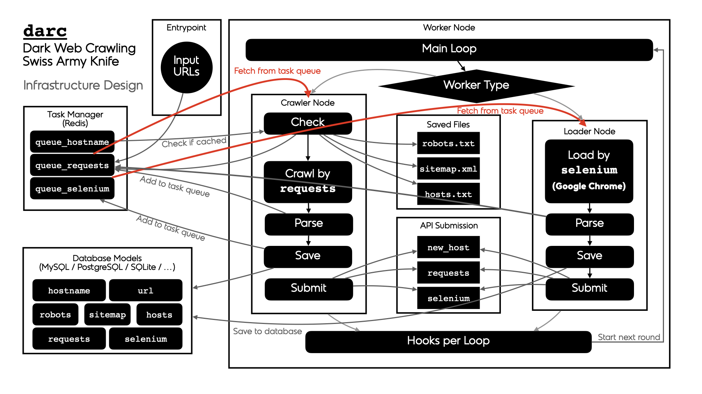

``darc`` - Darkweb Crawler Project
==================================

   For any technical and/or maintenance information,
   please kindly refer to the |docs|_.

.. |docs| replace:: **Official Documentation**
.. _docs: https://darc.jarryshaw.me

``darc`` is designed as a swiss army knife for darkweb crawling.
It integrates ``requests`` to collect HTTP request and response
information, such as cookies, header fields, etc. It also bundles
``selenium`` to provide a fully rendered web page and screenshot
of such view.

The general process of ``darc`` can be described as following:

There are two types of *workers*:

* ``crawler`` -- runs the ``darc.crawl.crawler`` to provide a
  fresh view of a link and test its connectability

* ``loader`` -- run the ``darc.crawl.loader`` to provide an
  in-depth view of a link and provide more visual information

The general process can be described as following for *workers* of ``crawler`` type:

1. ``darc.process.process_crawler``: obtain URLs from the ``requests``
   link database (c.f. ``darc.db.load_requests``), and feed such URLs to
   ``darc.crawl.crawler``.

   **NOTE:**

      If ``darc.const.FLAG_MP`` is ``True``, the function will be
      called with *multiprocessing* support; if ``darc.const.FLAG_TH``
      if ``True``, the function will be called with *multithreading*
      support; if none, the function will be called in single-threading.

2. ``darc.crawl.crawler``: parse the URL using
   ``darc.link.parse_link``, and check if need to crawl the
   URL (c.f. ``darc.const.PROXY_WHITE_LIST``, ``darc.const.PROXY_BLACK_LIST``,
   ``darc.const.LINK_WHITE_LIST`` and ``darc.const.LINK_BLACK_LIST``);
   if true, then crawl the URL with ``requests``.

   If the URL is from a brand new host, ``darc`` will first try
   to fetch and save ``robots.txt`` and sitemaps of the host
   (c.f. ``darc.proxy.null.save_robots`` and ``darc.proxy.null.save_sitemap``),
   and extract then save the links from sitemaps (c.f. ``darc.proxy.null.read_sitemap``)
   into link database for future crawling (c.f. ``darc.db.save_requests``).
   Also, if the submission API is provided, ``darc.submit.submit_new_host``
   will be called and submit the documents just fetched.

   If ``robots.txt`` presented, and ``darc.const.FORCE`` is
   ``False``, ``darc`` will check if allowed to crawl the URL.

   **NOTE:**

      The root path (e.g. ``/`` in https://www.example.com/) will always
      be crawled ignoring ``robots.txt``.

   At this point, ``darc`` will call the customised hook function
   from ``darc.sites`` to crawl and get the final response object.
   ``darc`` will save the session cookies and header information,
   using ``darc.save.save_headers``.

   **NOTE:**

      If `requests.exceptions.InvalidSchema` is raised, the link
      will be saved by ``darc.proxy.null.save_invalid``. Further
      processing is dropped.

   If the content type of response document is not ignored (c.f.
   ``darc.const.MIME_WHITE_LIST`` and ``darc.const.MIME_BLACK_LIST``),
   ``darc.submit.submit_requests`` will be called and submit the document
   just fetched.

   If the response document is HTML (``text/html`` and ``application/xhtml+xml``),
   ``darc.parse.extract_links`` will be called then to extract all possible
   links from the HTML document and save such links into the database
   (c.f. ``darc.db.save_requests``).

   And if the response status code is between ``400`` and ``600``,
   the URL will be saved back to the link database
   (c.f. ``darc.db.save_requests``). If **NOT**, the URL will
   be saved into ``selenium`` link database to proceed next steps
   (c.f. ``darc.db.save_selenium``).

The general process can be described as following for *workers* of ``loader`` type:

1. ``darc.process.process_loader``: in the meanwhile, ``darc`` will
   obtain URLs from the ``selenium`` link database (c.f. ``darc.db.load_selenium``),
   and feed such URLs to ``darc.crawl.loader``.

   **NOTE:**

      If ``darc.const.FLAG_MP`` is ``True``, the function will be
      called with *multiprocessing* support; if ``darc.const.FLAG_TH``
      if ``True``, the function will be called with *multithreading*
      support; if none, the function will be called in single-threading.

2. ``darc.crawl.loader``: parse the URL using
   ``darc.link.parse_link`` and start loading the URL using
   ``selenium`` with Google Chrome.

   At this point, ``darc`` will call the customised hook function
   from ``darc.sites`` to load and return the original
   ``selenium.webdriver.chrome.webdriver.WebDriver`` object.

   If successful, the rendered source HTML document will be saved, and a
   full-page screenshot will be taken and saved.

   If the submission API is provided, ``darc.submit.submit_selenium``
   will be called and submit the document just loaded.

   Later, ``darc.parse.extract_links`` will be called then to
   extract all possible links from the HTML document and save such
   links into the ``requests`` database (c.f. ``darc.db.save_requests``).

------------
Installation
------------

**NOTE:**

   ``darc`` supports Python all versions above and includes **3.6**.
   Currently, it only supports and is tested on Linux (*Ubuntu 18.04*)
   and macOS (*Catalina*).

   When installing in Python versions below **3.8**, ``darc`` will
   use |walrus|_ to compile itself for backport compatibility.

   .. |walrus| replace:: ``walrus``
   .. _walrus: https://github.com/pybpc/walrus

.. code-block:: shell

   pip install python-darc

Please make sure you have Google Chrome and corresponding version of Chrome
Driver installed on your system.

   Starting from version **0.3.0**, we introduced `Redis`_ for the task
   queue database backend.

   .. _Redis: https://redis.io

   Since version **0.6.0**, we introduced relationship database storage
   (e.g. `MySQL`_, `SQLite`_, `PostgreSQL`_, etc.) for the task queue database
   backend, besides the `Redis`_ database, since it can be too much memory-costly
   when the task queue becomes vary large.

   .. _MySQL: https://mysql.com/
   .. _SQLite: https://www.sqlite.org/
   .. _PostgreSQL: https://www.postgresql.org/

   Please make sure you have one of the backend database installed, configured,
   and running when using the ``darc`` project.

However, the ``darc`` project is shipped with Docker and Compose support.
Please see the project root for relevant files and more information.

Or, you may refer to and/or install from the `Docker Hub`_ repository:

.. code-block:: shell

   docker pull jsnbzh/darc[:TAGNAME]

.. _Docker Hub: https://hub.docker.com/r/jsnbzh/darc

-----
Usage
-----

The ``darc`` project provides a simple CLI::

   usage: darc [-h] [-v] -t {crawler,loader} [-f FILE] ...

   the darkweb crawling swiss army knife

   positional arguments:
     link                  links to craw

   optional arguments:
     -h, --help            show this help message and exit
     -v, --version         show program's version number and exit
     -t {crawler,loader}, --type {crawler,loader}
                           type of worker process
     -f FILE, --file FILE  read links from file

It can also be called through module entrypoint::

   python -m darc ...

**NOTE:**

   The link files can contain **comment** lines, which should start with ``#``.
   Empty lines and comment lines will be ignored when loading.
